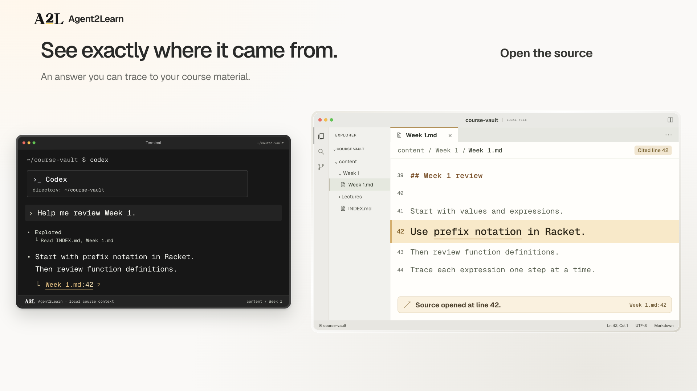

# Agent2Learn — Your Agent

The active revision is a **17.5-second product-demo launch film**, 1920×1080,
with a native 120fps master and a 60fps sharing version.

## Current Studio branding — Waterloo gold (2026-09-09)

The active `waterloo-gold` variant replaces the editorial raster logo with a
native outlined **A2L** wordmark: upright raised **2**, chamfered underline in Waterloo
**#FFD54F**, black lettering on light surfaces and white lettering in the terminal.
Gold is never inverted. The header, context receipt, terminal footer and closing
frame all use it. Timing, choreography, demo content and audio are unchanged.

The numeral now has a more upright bowl, a firmer horizontal foot and a vertical
right terminal. The A, L and gold underline are unchanged. This refinement is
based on main `204c97e` and preserves the website's merged gold-marker design.

The website uses the same vector master:
`frontend/src/assets/brand/a2l-waterloo-gold.svg`. From `frontend/`, run
`npm run brand:build` to generate both site and film assets. The manifest pins
the film's light and dark hashes. The current picture is available in Studio;
the preserved MP4s below have **not** been replaced with this identity.

## Current Studio soundtrack — Launchbeat (2026-09-08)

Studio now previews a punchier house/disco instrumental with a 4% pitch-preserving
tempo lift, stronger information-transfer accents, quiet context/logo chimes, and
a deliberate music dip at the source click. The subsequent visual cleanup removes
the long bottom disclaimer and replaces the Content tab's inset shadow with a
bottom-only blue underline. That edit kept the 17.5s timing and recorded
input Foley unchanged. The previous MP4s below still use
the previous soundtrack; **no new final movie export has been approved or replaced
them**.

- [Listen to the new 17.5s audio mix](renders/agent2learn-signalflow-launchbeat-audio.m4a)
- [Open the updated Studio](http://localhost:3017/#project/a2l-cinematic)
- [Soundtrack verification and boundaries](VERIFICATION-LAUNCHBEAT.md)

The active stems use `signalflow-launchbeat`; the prior `signalflow-polish`
stems remain intact. Prior cues and metadata are also saved locally in
`.archive/signalflow-agent-audio/`. To revert the preview, restore its saved
`launchflow-cues.json` to `src/` and run `npm run build` using the preserved stems.
Do not regenerate the old score merely to switch back.

The poster, storyboard and ingestion contact sheet are included in Git.
Video links refer to preserved **local** MP4s, not files distributed by this
checkout. See [Git publication scope](#git-publication-scope).



- [Watch — 60fps](renders/agent2learn-signalflow-agent.mp4)
- [Native 120fps master](renders/agent2learn-signalflow-agent-120fps.mp4)
- [Storyboard](renders/signalflow-agent-storyboard.jpg)
- [Poster](renders/signalflow-agent-poster.png)
- [Ingestion sequence — 36 frames](renders/signalflow-agent-ingestion-review.jpg)
- [Previous cut — Codex headline](renders/agent2learn-signalflow-polish.mp4)
- [Previous cut — original frontend logo](renders/agent2learn-signalflow.mp4)
- [Editable Studio](http://localhost:3017/#project/a2l-cinematic)

## This revision

The following describes the approved picture revision; the newer audio-only
preview above supersedes its soundtrack description.

A recognizable CS135-inspired Chrome/LEARN course, standard monochrome Lucide
icons, softer phrase-paced typing, document-to-information streams, chunked
Codex response and a stronger local-source reveal. Neutral white/black surfaces
with restrained warm citation emphasis. The approved editorial A2L artwork is
also adopted by the frontend at the owner's request.

This follow-up changes only the agent chapter headline to **Your Agent ×
Agent2Learn.** Codex remains the example in the terminal. All picture timing,
motion, source content and audio stems are unchanged. `exportPrefix` selects
new output filenames without changing the original `audioPrefix` or score.

Finishing changes: receipt accents now land at 7.20/7.36/7.52 seconds;
particles have a continuous faster-middle/decelerating path and a 0.26-second
absorption taper (31 native frame intervals). Their endpoint centres match
their receiving document icons. Source opened at line 42 and a restrained
underline of prefix notation make the proof clearer without another panel.

Question: “Help me review Week 1.”
Answer: “Start with prefix notation in Racket. Then review function definitions.”
Citation: Week 1.md:42 → “Use prefix notation in Racket.”

The note is original synthetic content inspired by public CS135 topic labels.
It is not an official teaching document or a real authenticated course capture.
The term and LEARN arrangement are illustrative. Setup and responses are
time-compressed; this work does not run auth, sync, install or live Codex.

## Location and preserved cuts

Project: `videos/a2l-cinematic/` in the `agent2learn-cinematic` worktree.
Branch: `motion/a2l-cinematic`.

No Python product code was edited. The frontend logo adoption is separately
scoped to `frontend/` on main. This source checkpoint is prepared for GitHub;
that is not a package release, website deployment or public film campaign. The preceding
polished source is in .archive/signalflow-polish17.5/; both of its MP4s remain
intact. Prior glassflow exports/audio remain untouched, with source and
documentation in .archive/glassflow17.5/. The immediately preceding Signalflow
cut is preserved in .archive/signalflow17.5/ and its exports/audio are intact.
Earlier launchflow16, codex13.5-demo
and showcase10-white archives and exports are also retained.

## Git publication scope

Git contains the editable composition, compiled HTML/CSS, pinned dependency
lockfile, approved A2L artwork and its prompt, monochrome icons and notices,
synthetic course notes, timing/Foley schedules, authoring tools, three reviewed
picture-only stills and verification reports. Historical authored experiments
remain available as source.

The following stay local and ignored: catalog music and Foley downloads,
audio stems, finished MP4s, old renders/source snapshots, reference material,
the superseded generated monogram, dependency copies and inspection caches.
None was deleted. `CREDITS.md` records music provenance but does not establish
the account's redistribution rights; confirm those before publicly distributing
the soundtrack or finished video. The public source alone cannot recreate the
approved soundtrack. Asset hashes and exact final MP4 hashes are recorded in
`audio_meta.json` and `VERIFICATION-AGENT.md`.

## Edit and reproduce

Edit src/launchflow.html.template, src/launchflow.css,
src/launchflow-motion.js and src/launchflow-cues.json. The names are historical;
their active output is Signalflow Polish. tools/build.mjs compiles HTML/CSS and the
single shared picture/Foley cue table. Demo provenance remains in the project
documentation and synthetic fixtures; the long on-screen footer was removed.
The older base styles and scripts are historical, not the active cut.

Requires Node 22+, Chrome and FFmpeg. `npm ci` plus `npm run build` restores
the generated local GSAP/font files from pinned dependencies and compiles the
picture; their original software licenses remain in `node_modules`.

For the full preview, audio tests and render, first restore the separately
licensed local audio assets listed in `CREDITS.md`. Audio rebuilding additionally
needs the original catalog files and `.media/manifest.jsonl`, plus uv and pinned
NumPy/SciPy. These are available in the author's existing worktree, not a fresh
Git clone; no account credentials or automatic catalog download are included.

```sh
set -e
npm ci
npm run score
HYPERFRAMES_NO_TELEMETRY=1 npm run dev -- --background --port 3017
npm test
HYPERFRAMES_NO_TELEMETRY=1 npm run check -- --strict --samples 60 --at-transitions
# Preserve an existing export before choosing to overwrite it.
HYPERFRAMES_NO_TELEMETRY=1 npm run render -- --fps 120 --quality high --workers 3 --crf 17 --no-best-effort --strict-all --output renders/agent2learn-signalflow-agent-120fps.mp4
ffmpeg -n -i renders/agent2learn-signalflow-agent-120fps.mp4 -vf fps=60 -c:v libx264 -preset slow -crf 18 -pix_fmt yuv420p -c:a copy -movflags +faststart renders/agent2learn-signalflow-agent.mp4
npm run test:export
npm run test:audio
npm run review:export
```

The 120fps master samples the authored timeline directly. The sharing version
selects alternate frames; there is no generated frame interpolation.

For the original title-only follow-up, `tools/preserve-title-audio.mjs` is an
optional, tightly guarded local archival operation: it also requires the exact
preceding approved MP4 and `.archive/signalflow-polish17.5/` cue snapshot. It is
not a general fresh-clone build step. It preserves the previous AAC without
re-encoding; see `VERIFICATION-AGENT.md` for the already-verified final hashes.

## Preserved logo options and revert

The previous transparent image is assets/brand/a2l-editorial-experiment.png.
Its exact generation prompt is assets/brand/a2l-editorial-experiment.prompt.md.
It borrows only the idea of confident editorial lettering from D2L; no D2L
artwork is included in the composition. The owner approved this artwork for
the website too; this does not claim D2L affiliation or trademark clearance.

```sh
# Preview the polished animation with the original book mark instead:
npm run build -- --brand=frontend
# Restore this experiment:
npm run build -- --brand=editorial
# Restore the current shared A2L / Waterloo-gold identity:
npm run build -- --brand=waterloo-gold
```

The default is selected by active in src/brand-variant.json. Change that field
to frontend to keep the book mark on subsequent normal builds. These commands
do not alter frontend code or existing MP4s. Choose a different output filename
if rendering another comparison. Placement PNGs are byte-identical copies,
not resampled artwork; they isolate a Chromium small/large image-cache issue.

## Evidence and limits

The verifier checks logo bytes, exact source lines, clicks, input/Foley timing,
token chunks, 36 bounded particle trajectories, forward/reverse states and
2,100 layout samples. Export verification checks full decode, frame count,
typing changes, final hold and AAC against an independent stem mix.

These are film checks, not a production ingestion/vault test or subjective
perfection claim. Music is a catalog track with a custom edit/Foley mix, not an
original composition. Confirm distribution rights before public release.

See BRIEF.md, STORYBOARD.md, RESEARCH.md, CREDITS.md and VERIFICATION-POLISH.md.
The headline-only follow-up is recorded separately in VERIFICATION-AGENT.md.
VERIFICATION.md remains the historical report for the previous Signalflow cut.
